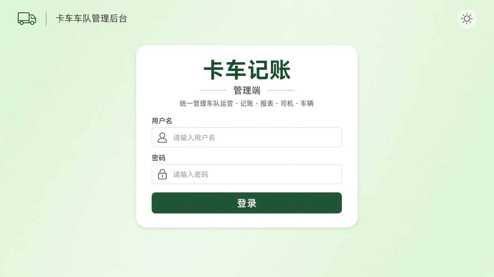
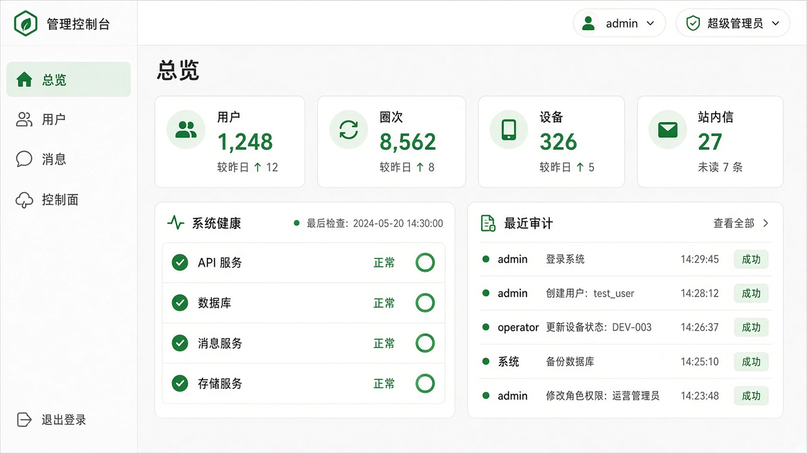
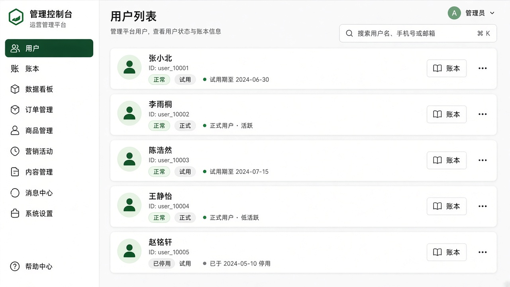
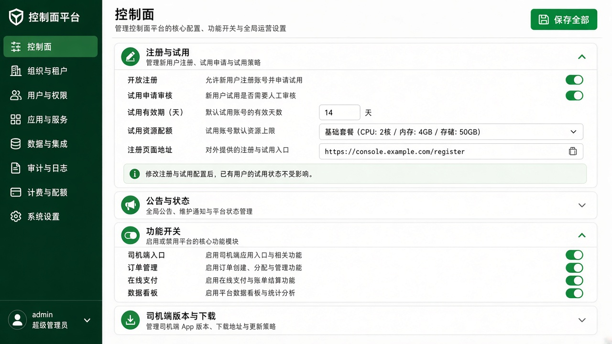

# 卡车记账 · 管理端（Flutter）

Android / iOS / Windows / Linux，对接 `/api/admin/*`。

## 发版与安装

**发布包一律由 CI 编译**（workflow：`Release Admin Packages`），本机不要 `flutter build` 出正式包。

- push `main` 且改动 `admin_app/**` 时自动触发；也可在 Actions 里手动跑。
- 产物：`truckledger-admin-latest.{apk,ipa}` 及 Linux / Windows 包，上传到服务器 `public/downloads/`，并挂到 GitHub Release（`admin-v*` + 主 App Latest）。
- Android 签名与主 App **共用**同一套 Secrets（见 [`android/SIGNING.md`](../android/SIGNING.md)、[`docs/MIGRATION.md`](../docs/MIGRATION.md)）。
- 细节：[`docs/CI_AUTO_RELEASE.md`](../docs/CI_AUTO_RELEASE.md)。

## 角色

| 角色 | 说明 |
|------|------|
| **开发者**（`super`） | 控制面、删用户、会计账号管理、设备吊销、快照恢复等 |
| **会计管理员**（`operator`） | 用户运营、查看/修改账本、发消息、导出 Excel；不能动控制面与底层运维 |

创建的会计管理员可禁用 / 重置密码 / **删除**（不可删开发者账号）。

## 能力

- 用户列表运营（延期/转正/踢下线等）
- 点进用户可查看账本、切换交账标记、高级 JSON 编辑、**导出 Excel**
- 开发者专属：控制面、会计账号管理

## UI 预览（设计示意）

改版后的壳层信息架构示意（浅色工作台 · 品牌绿）：

| 页面 | 预览 |
|------|------|
| 登录 |  |
| 总览 |  |
| 用户 |  |
| 控制面 |  |

预览为设计稿，与真机像素可有差异；宽屏为左侧导航，窄屏为底部导航。

## 本地调试

```bash
cd admin_app
flutter pub get
flutter run -d linux          # 或 windows / android / ios
```

默认 API 基址见 `lib/admin_api.dart`；Debug 下可改服务器地址。
