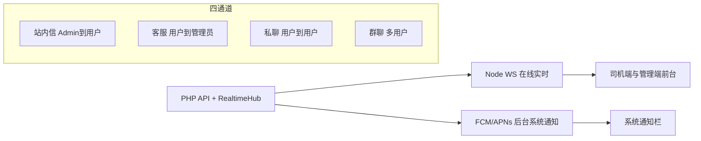

# 消息体系：站内信 / 客服 / 私聊 / 群聊

四通道职责分离；在线走 WebSocket，杀进程后靠 FCM/APNs 系统通知。



## 1. 站内通知（inbox / `messages`）

| 方向 | Admin → 用户（全体广播或指定用户） |
|------|-----------------------------------|
| 用户 | 查看、标记已读、**回复**（线程） |
| 管理端 | 发送、查看**已读回执**、**强制删除**、回复线程 |
| 删除权 | **仅管理端可强制删除**；删除后用户端立即不可见 |
| 用户删除 | 不允许删除原通知 |

类型示例：`ops.broadcast`、`account.notify`、`ops.reconcile`、`account.trial_expiring`。

## 2. 客服会话（support / `support_threads`）

| 方向 | 用户 ↔ 管理员（双向聊天） |
|------|---------------------------|
| 用户 | 「联系管理员」发起/继续会话、发送消息、看已读 |
| 管理端 | 会话列表、回复、强制删除整会话或单条 |
| 指定管理员 | `app_settings.support_admin_id`：`>0` 默认指派；`0` 表示任意有 `messages.manage` 的管理员可接待 |

每用户最多一条客服线程。管理员回复时同时 WS + FCM。

## 3. 私聊 / 群聊（chat / `chat_*`）

| 方向 | 用户 ↔ 用户 |
|------|-------------|
| 私聊 | `POST /api/chat/dm`，按有序 user 对去重 |
| 群聊 | `POST /api/chat/groups`，创建者 owner；可邀请成员 |
| 消息 | `msg_type=text`（本期）；预留 `image` / `audio` / `call_invite`（语音消息与音视频通话后续再做） |
| 管理端 | 「用户聊天」Tab：只读监管、删消息、解散会话（`messages.manage`） |

表：`chat_conversations`、`chat_members`、`chat_messages`。

## 未读角标

| 字段 | 用途 |
|------|------|
| `unread` / `support_unread` / `chat_unread_dm` / `chat_unread_group` | `GET /api/messages` |
| Tab「我的」合计 | 四者之和 |
| 消息中心「通知」 | 仅站内信 |
| 「客服」 | 仅客服 |
| 「聊天」 | dm + group |

## API 摘要

**用户：**  
- 站内信 / 客服：`GET/POST /api/messages…`、`GET /api/support/thread`、`POST /api/support/messages`  
- 聊天：`GET /api/chat/peers`、`/conversations`、`POST /api/chat/dm`、`/groups`、消息收发与已读  

**管理端：**  
- 站内信 / 客服既有接口  
- `GET/DELETE /api/admin/chat/conversations…`、`DELETE /api/admin/chat/messages/{id}`  

权限：`messages.send` 发送通知；`messages.manage` 管理/客服/用户聊天监管。

## 实时同步（WebSocket）

App、管理端登录后连接 `wss://域名/ws?token=JWT`。  
PHP 写库后向本机 `http://127.0.0.1:8765/publish` 发事件（`type`: `inbox` | `support` | `chat`）。

**软件内通知：** 顶部横幅 + 提示音，点击跳转；已读类事件只刷新列表不弹窗。

| 组件 | 说明 |
|------|------|
| `server-php/ws/server.js` | Node 枢纽（仅监听 127.0.0.1） |
| `bash ws/setup_baota_ws.sh` | 装 Node、注入 Nginx `/ws`、systemd |
| `GET /api/health?deep=1` | `checks.websocket` |

## 系统推送（FCM / APNs）

默认 **双发**：写库后同时 `RealtimeHub` + `PushService::sendToUser`。  
前台 App 收到 FCM 时走 `InAppNotifier`（iOS 关闭前台系统横幅），避免与软件内横幅叠两层。  
`local:` 占位 token 不发 FCM。

### 运维配置（HTTP v1）

1. Firebase 下载服务账号 JSON + `google-services.json`（+ iOS plist）到 `dev/fcm/`  
2. 执行 `./scripts/apply_fcm_credentials.sh`（上传服务端、本机客户端、可选 GitHub Secret）  
3. `config.php`：`fcm_service_account_file` → `data/fcm-service-account.json`  
4. CI Secret：`GOOGLE_SERVICES_JSON_BASE64`（Release APK 注入）  
5. Android 渠道 id：`messages`

详见 [`server-php/FCM_SETUP.md`](../server-php/FCM_SETUP.md)。

**说明：** 未配置服务账号或客户端未放 google-services 时，仍可靠站内信 + WS；杀进程后无系统通知。

### 试用到期推送

```bash
cd /www/wwwroot/truck.liner0211.online && php bin/notify_trial_expiring.php --days=3
```

## 服务器启用 WebSocket（部署脚本已自动）

`./one_click_server_deploy.sh` 在 rsync 后执行 `ws/setup_baota_ws.sh`。  
手动：`cd /www/wwwroot/… && bash ws/setup_baota_ws.sh`
